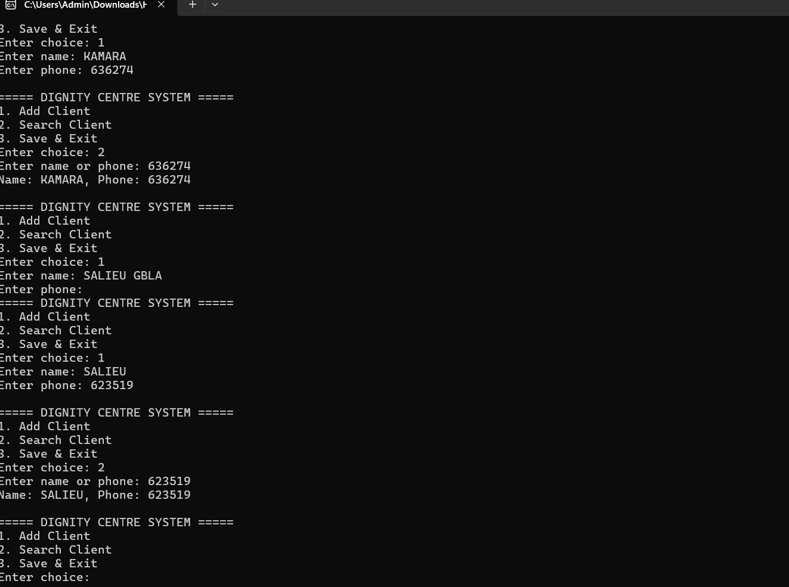

# Dignity Centre Management System

# Project Overview
The Dignity Centre Management System is a C++ console-based application designed to manage client records efficiently. The system helps staff organize and maintain information through registration, searching, updating, and deleting records using a simple menu-driven interface.

---

# Problem Statement
Managing client information manually can lead to data loss, inefficiency, and difficulty tracking records. This project provides a digital management system that simplifies storing, searching, updating, and deleting client information.

---

# Features
- Client registration
- Search records
- Update existing records
- Delete records
- File storage system
- Menu-driven interface
- Data management using file handling

---

## Technologies Used

- C++
- Object-Oriented Programming (OOP)
- File Handling (ifstream/ofstream)
- Vectors
- Classes and Structured Data

---

## Screenshots

### Main Menu

### Registration Page

### Search Feature

### Update/Delete Feature

---

## Future Improvements

- Convert system into a web-based platform
- Add secure authentication and login system
- Improve scalability using database integration
- Implement appointment scheduling
- Improve accessibility and user experience

---

## How to Run the Project

1. Open the project in a C++ IDE such as Code::Blocks or Visual Studio.
2. Compile the source code.
3. Run the program.
4. Use the menu options to manage records.

# 👤 Author
Gbla Salieu – Computer Information System student passionate about using technology to solve real-world problems in humanitarian contexts.
---

# 🌍 Impact
This project demonstrates how simple software solutions can improve service delivery for vulnerable communities.
